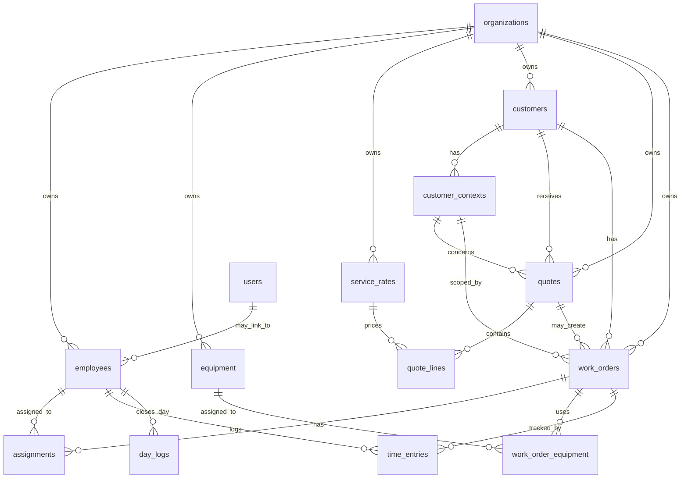

# ADR 0001: Schema de donnees global du MVP

- Status: Proposed
- Date: 2026-06-16
- Related issue: #4

## Contexte

Le MVP de Mestier doit couvrir le flux metier principal d'un artisan ou d'une
PME de services :

1. configurer les couts de l'entreprise ;
2. gerer les clients et leurs contextes metier ;
3. produire des devis detailles ;
4. planifier et assigner les chantiers ;
5. permettre aux employes de pointer et documenter le terrain ;
6. calculer la rentabilite reelle des chantiers.

Les issues #5 a #33 decoupent ce flux en milestones. Le schema de donnees doit
etre fixe avant d'implementer ces milestones afin d'eviter des migrations
contradictoires et de garantir que les calculs financiers restent coherents.

## Decision

Le MVP s'appuie sur les entites metier suivantes :

- `employees`
- `equipment`
- `service_rates`
- `customers`
- `customer_contexts`
- `quotes`
- `quote_lines`
- `work_orders`
- `assignments`
- `work_order_equipment`
- `time_entries`
- `day_logs`

Les entites existantes `users`, `organizations`, `organization_members` et
`roles` restent le socle d'identite, d'authentification et d'autorisation.

## Conventions globales

### Multi-tenant

Toutes les tables metier portent un `org_id` qui reference `organizations(id)`,
y compris les tables enfants et les tables de jonction. Cette redondance est
volontaire : elle simplifie l'autorisation, les filtres par organisation, les
indexes, et les futures extractions analytiques.

Tables avec `org_id` :

- `employees`
- `equipment`
- `service_rates`
- `customers`
- `customer_contexts`
- `quotes`
- `quote_lines`
- `work_orders`
- `assignments`
- `work_order_equipment`
- `time_entries`
- `day_logs`

Regle de coherence :

- les services backend et, si possible, les contraintes SQL doivent garantir
  que chaque parent reference appartient au meme `org_id` que la ligne enfant.

### Identifiants

Toutes les nouvelles tables metier utilisent une cle primaire `id UUID`.

L'intention produit est d'utiliser des UUID v7 pour les nouvelles donnees
metier, afin d'obtenir des identifiants ordonnables et compatibles avec les
index B-tree. Les migrations existantes utilisent aujourd'hui
`gen_random_uuid()`. Le choix concret de generation UUID v7 doit etre tranche
avant la premiere migration metier :

- generation cote application avec `Uuid::now_v7()` ; ou
- fonction PostgreSQL dediee si l'environnement la fournit.

Tant que cette decision technique n'est pas implementee, les nouvelles
migrations metier ne doivent pas introduire un melange implicite de strategies
d'identifiants.

### Dates

Les nouvelles tables metier utilisent par defaut :

- `created_at TIMESTAMPTZ NOT NULL DEFAULT now()`
- `updated_at TIMESTAMPTZ NOT NULL DEFAULT now()`
- `deleted_at TIMESTAMPTZ NULL` lorsque la suppression logique est applicable

Les heures terrain (`started_at`, `ended_at`) sont stockees en `TIMESTAMPTZ`.
Les dates de planning sans heure (`scheduled_date`, `work_date`) sont stockees
en `DATE`.

### Suppression logique

Les donnees metier editables par l'utilisateur sont supprimees logiquement avec
`deleted_at`.

Tables concernees :

- `employees`
- `equipment`
- `service_rates`
- `customers`
- `customer_contexts`
- `quotes`
- `quote_lines`
- `work_orders`

Les tables d'evenements ou de jonction peuvent etre supprimees physiquement
quand leur parent est supprime ou annule, sauf si elles portent une valeur
d'audit metier :

- `assignments`
- `work_order_equipment`
- `time_entries`
- `day_logs`

Les listes applicatives filtrent `deleted_at IS NULL` par defaut.

### Montants et quantites

Tous les montants sont stockes en centimes dans des colonnes `*_cents`.

Les prix ne sont jamais stockes en flottant. Les calculs backend utilisent des
entiers pour les montants et un decimal exact pour les quantites et les durees
si une precision fractionnaire est requise.

Unite de prestation :

- `HOUR`
- `ML`
- `M2`

### Photos et fichiers

Les tables metier ne stockent pas les fichiers binaires. Elles stockent des
cles opaques retournees par le service de stockage defini dans #3.

Colonnes prevues :

- `customer_contexts.photo_key`
- `quote_lines.photo_keys`
- futures photos de terrain liees aux chantiers ou pointages

`photo_keys` peut etre un `TEXT[]` pour le MVP si l'API de stockage retourne
une cle stable. Si des metadonnees de fichier deviennent necessaires
historique, auteur, type MIME ou taille, il faudra introduire une table
dediee `files`.

## Modele relationnel



## Tables metier

### employees

Representent les personnes qui peuvent etre assignees a un chantier ou utiliser
l'application terrain.

Colonnes principales :

- `id UUID PRIMARY KEY`
- `org_id UUID NOT NULL REFERENCES organizations(id)`
- `user_id UUID NULL REFERENCES users(id)`
- `name TEXT NOT NULL`
- `hourly_rate_cents INTEGER NOT NULL`
- `created_at TIMESTAMPTZ NOT NULL DEFAULT now()`
- `updated_at TIMESTAMPTZ NOT NULL DEFAULT now()`
- `deleted_at TIMESTAMPTZ NULL`

Regles :

- `user_id` est nullable tant que l'employe n'a pas accepte ou recu son compte
  Ferriskey.
- un `user_id` ne peut etre lie qu'a un seul employee actif dans une meme
  organisation.
- `hourly_rate_cents` doit etre positif ou nul.

### equipment

Representent les ressources materielles qui portent un cout horaire.

Colonnes principales :

- `id UUID PRIMARY KEY`
- `org_id UUID NOT NULL REFERENCES organizations(id)`
- `name TEXT NOT NULL`
- `hourly_rate_cents INTEGER NOT NULL`
- `created_at TIMESTAMPTZ NOT NULL DEFAULT now()`
- `updated_at TIMESTAMPTZ NOT NULL DEFAULT now()`
- `deleted_at TIMESTAMPTZ NULL`

Regles :

- le nom est unique par organisation parmi les equipements actifs ;
- `hourly_rate_cents` doit etre positif ou nul.

### service_rates

Representent le catalogue de prestations facturables.

Colonnes principales :

- `id UUID PRIMARY KEY`
- `org_id UUID NOT NULL REFERENCES organizations(id)`
- `label TEXT NOT NULL`
- `unit service_rate_unit NOT NULL`
- `rate_cents INTEGER NOT NULL`
- `created_at TIMESTAMPTZ NOT NULL DEFAULT now()`
- `updated_at TIMESTAMPTZ NOT NULL DEFAULT now()`
- `deleted_at TIMESTAMPTZ NULL`

Enum `service_rate_unit` :

- `HOUR`
- `ML`
- `M2`

Regles :

- `rate_cents` doit etre positif ou nul ;
- le label est unique par organisation parmi les tarifs actifs ;
- les lignes de devis copient le prix au moment de la creation afin de
  conserver l'historique commercial.

### customers

Representent les clients.

Colonnes principales :

- `id UUID PRIMARY KEY`
- `org_id UUID NOT NULL REFERENCES organizations(id)`
- `last_name TEXT NOT NULL`
- `first_name TEXT NOT NULL`
- `phone TEXT NULL`
- `email TEXT NULL`
- `created_at TIMESTAMPTZ NOT NULL DEFAULT now()`
- `updated_at TIMESTAMPTZ NOT NULL DEFAULT now()`
- `deleted_at TIMESTAMPTZ NULL`

Regles :

- un client appartient a une seule organisation ;
- un client peut avoir plusieurs contextes metier.

### customer_contexts

Representent un contexte rattache a un client : site, agence, projet,
departement interne, contrat, ou tout autre perimetre utile selon le metier de
l'organisation.

Colonnes principales :

- `id UUID PRIMARY KEY`
- `org_id UUID NOT NULL REFERENCES organizations(id)`
- `customer_id UUID NOT NULL REFERENCES customers(id)`
- `label TEXT NOT NULL`
- `address_line TEXT NULL`
- `postal_code TEXT NULL`
- `city TEXT NULL`
- `photo_key TEXT NULL`
- `created_at TIMESTAMPTZ NOT NULL DEFAULT now()`
- `updated_at TIMESTAMPTZ NOT NULL DEFAULT now()`
- `deleted_at TIMESTAMPTZ NULL`

Regles :

- un contexte client depend d'un client ;
- `org_id` doit etre identique au `customers.org_id` du client parent ;
- les champs d'adresse sont optionnels et ne doivent pas etre utilises pour
  imposer un modele lie au terrain ;
- `photo_key` reference le service de stockage, pas un chemin local.

### quotes

Representent les devis.

Colonnes principales :

- `id UUID PRIMARY KEY`
- `org_id UUID NOT NULL REFERENCES organizations(id)`
- `customer_id UUID NOT NULL REFERENCES customers(id)`
- `customer_context_id UUID NOT NULL REFERENCES customer_contexts(id)`
- `status quote_status NOT NULL`
- `total_cents INTEGER NOT NULL`
- `created_at TIMESTAMPTZ NOT NULL DEFAULT now()`
- `updated_at TIMESTAMPTZ NOT NULL DEFAULT now()`
- `deleted_at TIMESTAMPTZ NULL`

Enum `quote_status` :

- `DRAFT`
- `SENT`
- `ACCEPTED`
- `DECLINED`
- `CANCELLED`

Regles :

- `total_cents` est calcule cote backend a partir des lignes ;
- l'API refuse un `customer_context_id` qui n'appartient pas au `customer_id` ;
- un devis accepte peut servir a creer un chantier.

### quote_lines

Representent les lignes detaillees d'un devis.

Colonnes principales :

- `id UUID PRIMARY KEY`
- `org_id UUID NOT NULL REFERENCES organizations(id)`
- `quote_id UUID NOT NULL REFERENCES quotes(id)`
- `service_rate_id UUID NULL REFERENCES service_rates(id)`
- `label TEXT NOT NULL`
- `quantity NUMERIC NOT NULL`
- `unit service_rate_unit NOT NULL`
- `unit_price_cents INTEGER NOT NULL`
- `notes TEXT NULL`
- `photo_keys TEXT[] NOT NULL DEFAULT '{}'`
- `created_at TIMESTAMPTZ NOT NULL DEFAULT now()`
- `updated_at TIMESTAMPTZ NOT NULL DEFAULT now()`
- `deleted_at TIMESTAMPTZ NULL`

Regles :

- `service_rate_id` est nullable pour permettre une ligne libre ;
- `org_id` doit etre identique au `quotes.org_id` du devis parent ;
- si `service_rate_id` est renseigne, le tarif doit appartenir au meme
  `org_id` ;
- `label`, `unit` et `unit_price_cents` sont copies dans la ligne pour figer
  le devis meme si le catalogue change ensuite ;
- le sous-total est `quantity * unit_price_cents`, arrondi en centimes selon
  une regle backend unique.

### work_orders

Representent les chantiers planifies ou issus d'un devis.

Colonnes principales :

- `id UUID PRIMARY KEY`
- `org_id UUID NOT NULL REFERENCES organizations(id)`
- `customer_id UUID NOT NULL REFERENCES customers(id)`
- `customer_context_id UUID NOT NULL REFERENCES customer_contexts(id)`
- `quote_id UUID NULL REFERENCES quotes(id)`
- `scheduled_date DATE NOT NULL`
- `status work_order_status NOT NULL`
- `note TEXT NULL`
- `created_at TIMESTAMPTZ NOT NULL DEFAULT now()`
- `updated_at TIMESTAMPTZ NOT NULL DEFAULT now()`
- `deleted_at TIMESTAMPTZ NULL`

Enum `work_order_status` :

- `PLANNED`
- `IN_PROGRESS`
- `DONE`
- `CANCELLED`

Regles :

- un chantier peut etre cree depuis un devis ou directement depuis un client ;
- `quote_id` est nullable pour les interventions sans devis ;
- l'API refuse un `customer_context_id` qui n'appartient pas au `customer_id` ;
- la note peut etre pre-remplie depuis la fiche client ou le contexte client, puis
  surchargee manuellement.

### assignments

Representent l'assignation des employes aux chantiers.

Colonnes principales :

- `id UUID PRIMARY KEY`
- `org_id UUID NOT NULL REFERENCES organizations(id)`
- `work_order_id UUID NOT NULL REFERENCES work_orders(id)`
- `employee_id UUID NOT NULL REFERENCES employees(id)`
- `created_at TIMESTAMPTZ NOT NULL DEFAULT now()`

Regles :

- contrainte unique `(work_order_id, employee_id)` ;
- `org_id`, l'employe et le chantier doivent appartenir a la meme organisation ;
- un chantier peut avoir plusieurs employes.

### work_order_equipment

Representent le materiel prevu ou utilise sur un chantier.

Colonnes principales :

- `id UUID PRIMARY KEY`
- `org_id UUID NOT NULL REFERENCES organizations(id)`
- `work_order_id UUID NOT NULL REFERENCES work_orders(id)`
- `equipment_id UUID NOT NULL REFERENCES equipment(id)`
- `created_at TIMESTAMPTZ NOT NULL DEFAULT now()`

Regles :

- contrainte unique `(work_order_id, equipment_id)` ;
- `org_id`, l'equipement et le chantier doivent appartenir a la meme
  organisation ;
- ce lien est utilise par le calcul de rentabilite.

### time_entries

Representent le temps passe par un employe sur un chantier.

Colonnes principales :

- `id UUID PRIMARY KEY`
- `org_id UUID NOT NULL REFERENCES organizations(id)`
- `work_order_id UUID NOT NULL REFERENCES work_orders(id)`
- `employee_id UUID NOT NULL REFERENCES employees(id)`
- `started_at TIMESTAMPTZ NOT NULL`
- `ended_at TIMESTAMPTZ NULL`
- `created_at TIMESTAMPTZ NOT NULL DEFAULT now()`
- `updated_at TIMESTAMPTZ NOT NULL DEFAULT now()`

Regles :

- `org_id`, l'employe et le chantier doivent appartenir a la meme organisation ;
- un employe ne peut avoir qu'un seul `time_entry` actif (`ended_at IS NULL`)
  a la fois ;
- `ended_at` doit etre superieur a `started_at` ;
- un pointage ne peut exister que pour un employe assigne au chantier, sauf
  decision explicite contraire dans l'API terrain.

### day_logs

Representent la fin de journee declaree par un employe.

Colonnes principales :

- `id UUID PRIMARY KEY`
- `org_id UUID NOT NULL REFERENCES organizations(id)`
- `employee_id UUID NOT NULL REFERENCES employees(id)`
- `work_date DATE NOT NULL`
- `ended_at TIMESTAMPTZ NOT NULL`
- `created_at TIMESTAMPTZ NOT NULL DEFAULT now()`

Regles :

- `org_id` doit etre identique au `employees.org_id` de l'employe ;
- contrainte unique `(employee_id, work_date)` ;
- la fin de journee ne cloture pas automatiquement tous les chantiers actifs si
  l'API detecte un pointage encore ouvert ; elle doit retourner une erreur ou
  une alerte exploitable par l'interface terrain.

## Formule de rentabilite

La rentabilite est calculee cote backend, jamais uniquement dans le frontend.

Pour un chantier donne :

```text
employee_cost_cents =
  sum(duration_hours(time_entries) * employee.hourly_rate_cents)

equipment_cost_cents =
  sum(total_work_order_duration_hours * equipment.hourly_rate_cents)

real_cost_cents =
  employee_cost_cents + equipment_cost_cents

revenue_cents =
  quote.total_cents when work_orders.quote_id is not null
  otherwise 0 until a manual billed amount exists

margin_cents =
  revenue_cents - real_cost_cents

margin_rate =
  margin_cents / revenue_cents when revenue_cents > 0
```

Precision :

- `duration_hours` est calculee a partir de `started_at` et `ended_at` ;
- les durees ouvertes ne sont pas incluses dans les rapports finalises ;
- la duree materiel MVP est la duree totale du chantier, deduite des pointages
  employes ; si le produit doit suivre l'utilisation reelle du materiel, il
  faudra ajouter des pointages materiel dedies.

## Index et contraintes attendus

Chaque migration metier doit prevoir les index utiles aux listes principales :

- index sur tous les `org_id` ;
- index sur toutes les cles etrangeres ;
- index partiels pour les unicites actives avec `deleted_at IS NULL` ;
- index sur `work_orders(scheduled_date)` ;
- index sur `time_entries(employee_id, started_at)` ;
- index partiel pour garantir un seul pointage actif par employe.

Exemples de contraintes a prevoir :

- `employees(org_id, user_id)` unique quand `user_id IS NOT NULL` et
  `deleted_at IS NULL` ;
- `assignments(work_order_id, employee_id)` unique ;
- `work_order_equipment(work_order_id, equipment_id)` unique ;
- `day_logs(employee_id, work_date)` unique ;
- `time_entries(employee_id)` unique quand `ended_at IS NULL`.

## Consequences

Cette decision permet de developper les milestones suivantes dans un ordre
stable :

1. referentiel couts ;
2. clients et proprietes ;
3. devis ;
4. chantiers et assignations ;
5. pointage terrain ;
6. rentabilite.

Elle impose aussi quelques garde-fous :

- les calculs financiers doivent rester dans le backend ou une lib partagee
  backend ;
- les photos restent des references vers un service de stockage ;
- les ecrans frontend ne deviennent pas source de verite pour les totaux de
  devis ou les marges ;
- les requetes API doivent toujours verifier l'appartenance a l'organisation
  avant de lire ou modifier une ressource.
